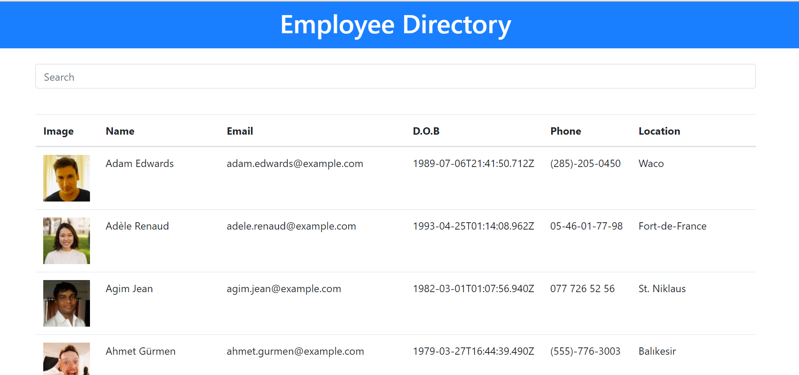

# React-Employee-Directory

## Description

This Application allows us to view entire employee directory at once so that one can have quick access to employee information.

## Usage 

Given a table of random users generated from the [Random User API](https://randomuser.me/), when the user loads the page, a table of employees should render. 

The user should be able to:

* Sort the table by at least one category

* Filter the users by at least one property.

## Sources Referred 

https://www.w3schools.com/js/js_array_sort.asp

https://stackoverflow.com/questions/44312924/filter-array-of-objects-whose-any-properties-contains-a-value

## URL of Deployed Application

https://shravaniallamreddy.github.io/EmployeeDirectory/